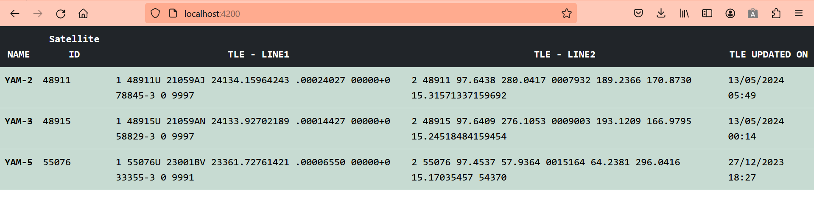

# Overview

Satdb is a lightweight and type-safe [Django]((https://www.djangoproject.com/)) app for storing and querying Satellite informations such as its owner, payloads, TLE info and launcher.

The objective of the project is to exploit:

- GraphQL capabilities
- WebSocket subscriptions
- Multi-container architecture with docker compose

> In time, with resources and a bit more effort, 
> this minimalist project can be scaled into a comprehensive
> Satellelite Database Management System.
> For now, the Satellite table is populated with YAM satellites
> using NASA's TLE API.
> The other tables (Payload, Launcher and Owner) are empty, but
> for test purpose they can be populated using
> the fixtures provided in the code.

---

## Features

| Type | Description |
| ------ | ------ |
| Backend | Django with GraphQL API framework using graphene and graphene-django. |
| Fetch Service | A service to periodically fetch TLE information from an Open API. |
| Frontend | Minimalist frontend in Angular/Typescript/Bootstrap to display the satellite table and TLE. |
| CI Gitlab | CI pipelines for QA and testing on [Gitlab](https://gitlab.com/webfw1/satdb) |
| CI Github | Actions for QA and testing on Github. (**To be tested on github**)|
| Containerisation | Two dockerfiles and a docker-compose.yml. (Dev mode, without nginx) |
| Fixtures | Four fixtures to generate initial data for tests. |
| Unit Testing | Of course! (TODO: fetcher service unit tests are commented, WIP).|
| Package Management | Packages and dependencies installation using Poetry as well as pip. |
| Database | A default sqlite database. |
| Djang Admin | Django admin views. |


## Recommendations for Production environment

- Use celery to fetch the data from TLE API.
- TLE API is paginated. Recursive fetching needed to fetch all the satellites.
- Use Postgresql instead of sqlite.
- Manage CSRF token. For dev purpose, it is disabled on graphql queries.
- Configure CORS_ALLOWED_ORIGINS in ./satdb/settings.py
- Add Nginx layer to serve the frontend.
- Refactor Dockerfiles.
- Frontend (./satfront) could be in a separate code base.
- Handle authentification, permissions and security.

---

## Database Schema


---

## Frontend demo



---

#  Installation

## Project Requirements

- [Python](https://www.python.org/) 3.10.*
- [Django](https://www.djangoproject.com/) 4.2.*
- [Angular](https://angular.io/guide/setup-local) 17.3.*
- [Node](https://nodejs.org/en/blog/announcements/v22-release-announce) 22.0.0
- [NPM](https://docs.npmjs.com/downloading-and-installing-node-js-and-npm) 10.7.0
- [Docker](https://www.docker.com/).
- [Docker Compose](https://docs.docker.com/compose/install/).
- [Backend dependencies](pyproject.toml)
- [Frontend dependencies](satfront/package.json)

## Variables

1. Fetch service uses the url set in following variable in django settings to fetch
satellite information.

```sh
SATELLITE_FEED_URL = os.environ.get(
                        "SATELLITE_FEED_URL",
                        "https://data.ivanstanojevic.me/api/tle/?search=yam-")
```

2. Fetch frequency is set to 1 hour in django settings.

```sh
FETCH_TLE_FREQUENCY = 3600
```

### Installation - Local

##### Backend

1. **Install dependencies:**

    ```sh
    cd satdb
    poetry install
    ```

2. **Run migrations:**

    ```sh
    poetry run python manage.py migrate
    ```

3. **Run the backend:**

    ```sh
    poetry run python manage.py runserver 0.0.0.0:8000
    ```

4. **Run the fetch service:**

    ```sh
    poetry run python fetch_service\tle_updater.py
    ```

##### Fronted
  
1. **Install node.js v22.0.0**

2. **Install packages and launch**

    ```sh
    npm install -g @angular/cli
    cd satfront
    npm install
    ng serve
    ```
    
### Installation - Docker

1. **Build the Docker image:**

    ```sh
    docker build -t satdb .
    ```
2. **Launch Docker Compose:**

    ```sh
    docker-compose up
    ```

## Populate initial data with fixtures for tests

1. **For Local environment:**

    ```sh
    poetry run python manage.py loaddata owners
	poetry run python manage.py loaddata satellites
	poetry run python manage.py loaddata payloads
	poetry run python manage.py loaddata launchers
    ```
2. **For Docker environment:**

    ```sh
	docker exec <container_id_or_name> bash -c "python /code/manage.py loaddata owners"
    docker exec <container_id_or_name> bash -c "python /code/manage.py loaddata satellites"
    docker exec <container_id_or_name> bash -c "python /code/manage.py loaddata payloads"
    docker exec <container_id_or_name> bash -c "python /code/manage.py loaddata launchers"
    ```

---

#  Usage

After installation is done:

- **To make Graphql queries:**  <http:\\localhost:8000\graphql\>

- **To consult django admin page:**  <http:\\localhost:8000\admin\> (login: admin, password: satdbadmin)

- **To view frontend:** <http:\\localhost:4200\>

---

##  GraphQL Query examples

1. **Query: get all satellites:**

    ```graphql
        query {
            allSatellites {
                name
                satId
                tleDate
                line1
                line2
                owner {
                    name
                }
            }
        }
    ```

2. **Mutation: create a satellite:**

    ```graphql
        mutation {
            createSatellite(name: "James Webb",
                            satId: 22222,
                            tleDate: "2024-05-11",
                            line1: "AZERTY",
                            line2: "QWERTY") {
                satellite {
                    id
                    name
                    satId
                    tleDate
                    line1
                    line2
                }
            }
        }
    ```

2. **Mutation: update a satellite name:**

    ```graphql
        mutation {
            updateSatellite(id: <satellite_pk>, name: "YAMX") {
                satellite {
                    name
                }
            }
        }
    ```

2. **Query: get payloads:**

    ```graphql
        query {
            allPayloads {
                provider
                type
                description
                satellite {
                    name
                }
            }
        }
    ```

2. **Mutation: create payload for a satellite:**

    ```graphql
        mutation {
            createPayload(provider: "SpaceX",
                          satelliteId: <satellite_pk>,
                          type: "Camera",
                          description: "High-resolution camera") {
              payload {
                id
                provider
                type
                description
                satellite {
                  id
                  name
                }
              }
            }
          }
    ```

2. **Mutation: update payload for a satellite:**

    ```graphql
        mutation {
            updatePayload(id: <payload_pk>,
                          provider:
                          "SpaceX",
                          satelliteId: <satellite_pk>,
                          type: "Camera",
                          description: "High-resolution camera") {
              payload {
                id
                provider
                type
                description
                satellite {
                  id
                  name
                }
              }
            }
          }
    ```

## License

MIT

**Definitely Free Software, this one!**
