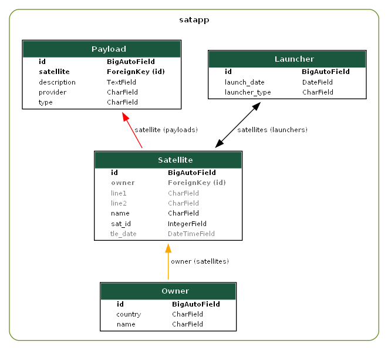

# Overview

Satdb is a lightweight and type-safe [Django]((https://www.djangoproject.com/)) app for storing and querying Satellite informations such as its owner, payloads, TLE info and launcher.

The objective of the project is to exploit:

- GraphQL querying capabilities 
- WebSocket subscriptions for updates

> Given more resources, this may evolve into a comprensive Satellelite Database Management System.

## Features

| Type | Description |
| ------ | ------ |
| Backend | Django backend with GraphQL API framework using graphene and graphene-django. |
| Fetch Service | a service that periodically fetches TLE information from an Open API. Celery could also be used. |
| Frontend | TODO: working on it. I haven't yet decided whether to use Angular or React. |
| CI Gitlab | CI pipelines for QA and testing on [Gitlab](https://gitlab.com/webfw1/satdb) |
| CI Github | Actions for QA and testing on Github. |
| Containerisation | a dockerfile and a docker-compose.yml. |
| Fixtures | fixtures to generate initial data for tests. |
| Unit Testing | Of course! Fetcher service unit tests are yet to be implemented.|
| Package Management | Package and dependencies installation using Poetry as well as pip. |
| Database | A default sqlite database. Postgresql is recommended. |

---

## Database Schema



---

#  Installation

## Project Requirements

- [Python](https://www.python.org/) 3.10.*
- [Django](https://www.djangoproject.com/) 4.2.*
- [Docker](https://www.docker.com/).
- [Docker Compose](https://docs.docker.com/compose/install/).
- [Dependencies](pyproject.toml)

### Installation - Local

1. **Install dependencies:**
    
    ```sh
    cd satdb
    poetry install
    ```

3. **Run migrations:**

    ```sh
    poetry run python manage.py migrate
    ```

4. **Run the backend:**

    ```sh
    poetry run python manage.py runserver 0.0.0.0:8000
    ```

5. **Run the fetch service:**

    ```sh
    poetry run python fetch_service\tle_updater.py 
    ```

6. **Query data in django admin page:**

    Go to your internet browser and consult: http:\\localhost:8000\graphql\


### Installation - Docker

1. **Build the Docker image:**

    ```sh
    docker build -t satdb .
    ```
2. **Launch Docker Compose:** 

    ```sh
    docker-compose up
    ```

## Populate initial data with fixtures for tests

1. **For Local environment:**

    ```sh
    poetry run python manage.py loaddata
    ```
2. **For Docker environment:** 

    ```sh
    docker exec <container_id_or_name> bash -c "python /code/manage.py loaddata"
    ```


##  Query examples

1. **Query: get all satellites:**

    ```graphql
        query {
            allSatellites {
                name
                satId
                tleDate
                line1
                line2
                owner {
                    name
                }
            }
        }
    ```

2. **Mutation: create a satellite:** 

    ```graphql
        mutation {
            createSatellite(name: "James Webb",
                            satId: 22222,
                            tleDate: "2024-05-11",
                            line1: "AZERTY",
                            line2: "QWERTY") {
                satellite {
                    id
                    name
                    satId
                    tleDate
                    line1
                    line2
                }
            }
        }
    ```

2. **Mutation: update a satellite name:** 

    ```graphql
        mutation {
            updateSatellite(id: <satellite_pk>, name: "YAMX") {
                satellite {
                    name
                }
            }
        }
    ```

2. **Query: get payloads:** 

    ```graphql
        query {
            allPayloads {
                provider
                type
                description
                satellite {
                    name
                }
            }
        }
    ```
    
2. **Mutation: create payload for a satellite:** 

    ```graphql
        mutation {
            createPayload(provider: "SpaceX",
                          satelliteId: <satellite_pk>,
                          type: "Camera",
                          description: "High-resolution camera") {
              payload {
                id
                provider
                type
                description
                satellite {
                  id
                  name
                }
              }
            }
          }
    ```

2. **Mutation: update payload for a satellite:** 

    ```graphql
        mutation {
            updatePayload(id: <payload_pk>,
                          provider:
                          "SpaceX",
                          satelliteId: <satellite_pk>,
                          type: "Camera",
                          description: "High-resolution camera") {
              payload {
                id
                provider
                type
                description
                satellite {
                  id
                  name
                }
              }
            }
          }
    ```

## License

MIT

**Definitely Free Software, this one!**
